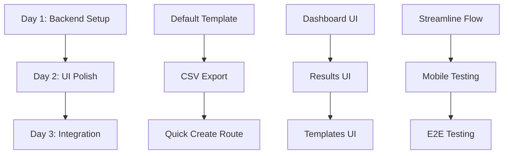

# Survey Feature MVP Enhancement Plan
*3-Day Sprint for Launch-Ready Improvements*

## Overview
**Goal**: Polish and enhance the existing survey system while preserving all current functionality  
**Timeline**: 3 days (14-16 hours total)  
**Approach**: Add conveniences and polish without breaking existing features

## Day 1: Template & Backend Setup
**Total Time**: 4-5 hours

### Task 1.1: Create Default Survey Template
**Agent**: @agent-backend-architect  
**Time**: 1.5 hours  
**Description**: Create and seed a default "Post-Activity Feedback" template in the database

**Subtasks**:
- Create migration to add default template to survey_template table
- Design 5 universal questions that work for any activity type
- Add template with proper JSON structure for questions
- Set as recommended/default template flag

**Questions to Include**:
1. Overall satisfaction (1-5 rating)
2. Instructor/facilitator rating (1-5 rating)
3. What did you enjoy most? (open text)
4. What could be improved? (open text)
5. Would you recommend to others? (yes/no)

### Task 1.2: Add CSV Export Functionality
**Agent**: @agent-backend-architect  
**Time**: 2 hours  
**Description**: Implement CSV export for survey results

**Subtasks**:
- Create export route in app.py (`/survey/<id>/export`)
- Generate CSV with responses, timestamps, and user data
- Add proper headers and formatting
- Handle different question types appropriately

### Task 1.3: Add Quick Survey Creation Route
**Agent**: @agent-backend-architect  
**Time**: 1 hour  
**Description**: Create streamlined survey creation endpoint

**Subtasks**:
- Add route for quick survey creation using default template
- Auto-populate template selection
- Reduce required fields to minimum
- Maintain compatibility with existing creation flow

---

## Day 2: UI Polish & Frontend Improvements
**Total Time**: 6 hours

### Task 2.1: Update Survey Dashboard UI
**Agent**: @agent-flask-ui-developer  
**Time**: 2.5 hours  
**File**: `templates/surveys.html`  
**Description**: Replace custom CSS with Tabler.io components

**Subtasks**:
- Replace custom statistics cards with Tabler.io card components
- Update filter panel to use Tabler.io form styling
- Replace custom buttons with Tabler.io button classes
- Ensure consistent spacing and alignment
- Add "Quick Survey" action button

**Key Changes**:
```html
<!-- Replace custom stats-card with Tabler.io -->
<div class="row row-cards">
  <div class="col-sm-6 col-lg-3">
    <div class="card card-sm">
      <!-- Tabler.io stats content -->
    </div>
  </div>
</div>
```

### Task 2.2: Enhance Survey Results Page
**Agent**: @agent-flask-ui-developer  
**Time**: 2 hours  
**File**: `templates/survey_results.html`  
**Description**: Improve results visualization

**Subtasks**:
- Replace custom progress bars with Tabler.io progress components
- Add export button with proper Tabler.io styling
- Improve response cards layout
- Add response count badges
- Ensure mobile responsiveness

### Task 2.3: Polish Survey Templates Page
**Agent**: @agent-flask-ui-developer  
**Time**: 1.5 hours  
**File**: `templates/survey_templates.html`  
**Description**: Highlight default template and improve UI

**Subtasks**:
- Add "Recommended" badge to default template
- Improve template card design with Tabler.io
- Add preview functionality for default template
- Ensure create template button is prominent

---

## Day 3: Integration & Testing
**Total Time**: 4-5 hours

### Task 3.1: Streamline Survey Creation Flow
**Agent**: @agent-flask-ui-developer  
**Time**: 1.5 hours  
**Description**: Add quick survey creation interface

**Subtasks**:
- Add modal or simplified form for quick survey creation
- Pre-select default template
- Reduce form to essential fields only
- Add preview before sending invitations

### Task 3.2: Mobile Optimization
**Agent**: @agent-ui-designer + @agent-flask-ui-developer  
**Time**: 1.5 hours  
**Description**: Ensure perfect mobile experience

**Subtasks**:
- Test all survey pages on mobile devices
- Fix any responsive issues
- Optimize touch targets
- Ensure forms are mobile-friendly

### Task 3.3: End-to-End Testing
**Agent**: Any available agent  
**Time**: 2 hours  
**Description**: Complete testing of survey flow

**Test Scenarios**:
1. Create survey using quick action → Send invitations → Take survey → View results → Export CSV
2. Create custom template → Create survey from template → Full flow
3. Mobile device testing for all pages
4. Bulk operations testing
5. Email invitation testing

---

## Implementation Order & Dependencies



## Success Criteria
- [ ] Default template available and working
- [ ] CSV export generates valid files
- [ ] All pages use Tabler.io components consistently
- [ ] Quick survey creation reduces steps by 50%
- [ ] Mobile experience is smooth
- [ ] No existing functionality is broken
- [ ] All tests pass

## Post-Launch Enhancements (Future)
- Additional activity-specific templates
- Advanced analytics dashboard
- Bulk survey operations
- Custom branding options
- AI-powered question suggestions
- Response sentiment analysis

## Notes for Agents
- **IMPORTANT**: Do not remove or modify existing functionality
- Use only Tabler.io components (already installed in `/static/tabler/`)
- Test on mobile after each UI change
- Maintain backward compatibility with existing surveys
- Focus on user experience improvements

## Risk Mitigation
- Keep all changes additive (don't remove features)
- Test existing surveys after each change
- Have rollback plan if issues arise
- Document any database changes

---

*This plan ensures a professional, polished survey system ready for launch while preserving all existing work and allowing for future enhancements.*