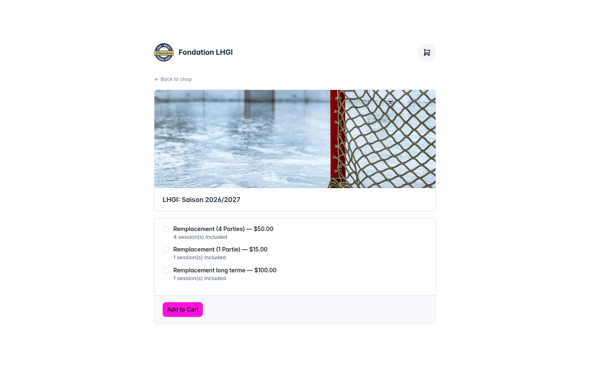
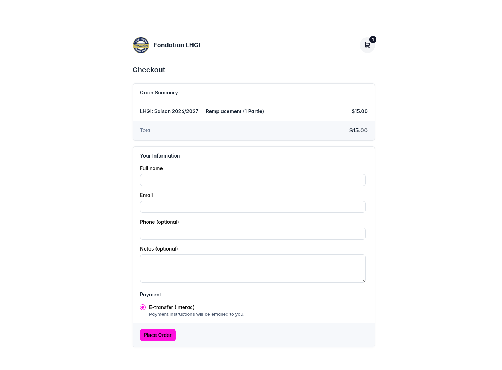
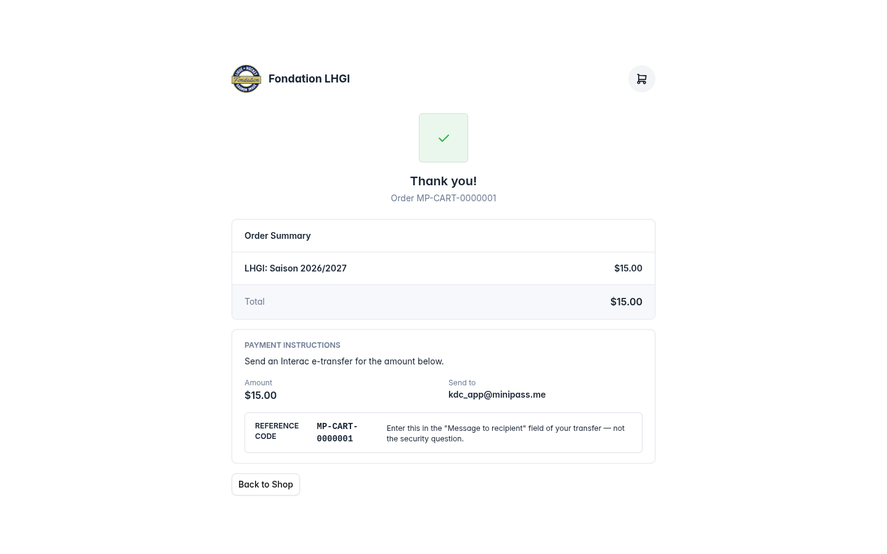
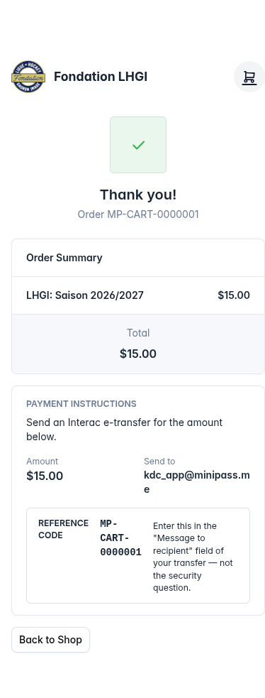
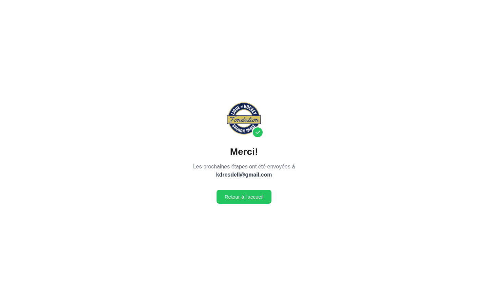
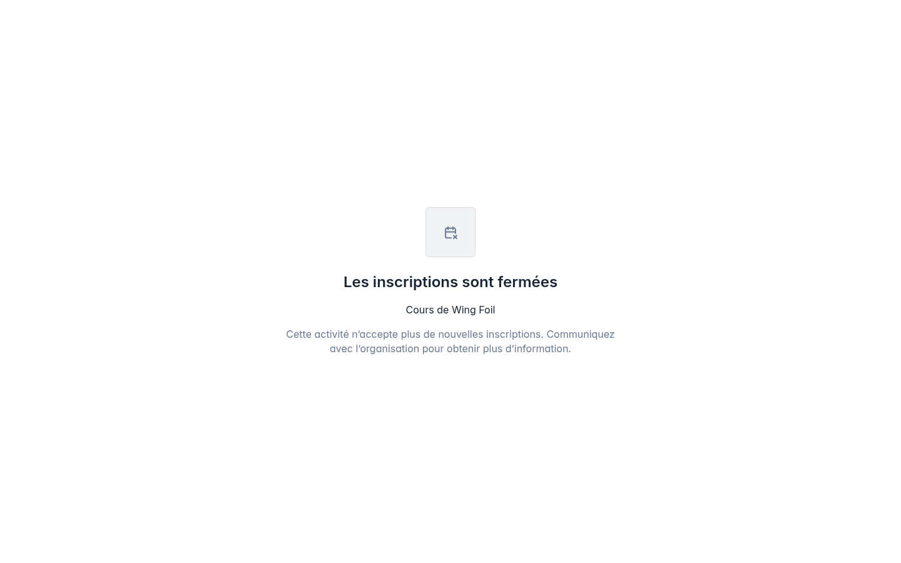
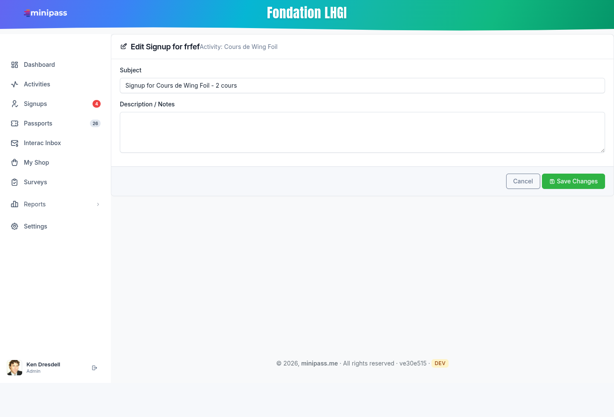
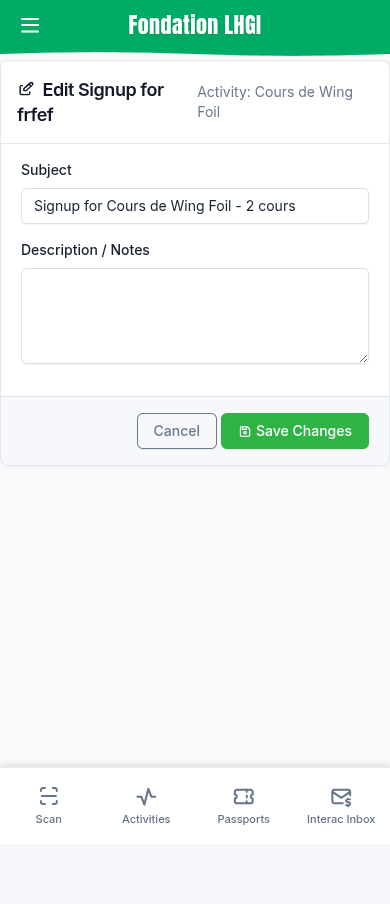

# Six-Page Audit — Shop & Signup Templates

Validated in a real browser against the local Flask server (`localhost:5000`),
tenant **Fondation LHGI**, on 2026-09-12. Desktop 1440px, mobile 390px.

> **✅ Resolved 2026-09-13.** All six verdicts below have been acted on, and the
> whole public shop flow (not just the three audited shop pages) was reworked in
> the same pass. The findings are kept as written for the record — the "Status"
> lines are what shipped. See **Outcome** at the bottom of this file.

## Summary Table

| # | Page | URL (local) | Verdict | Shipped |
|---|------|-------------|---------|---------|
| 1 | Shop activity | `/shop/activity/13` | Keep, polish | ✅ One card, priced `choice_cards`, live total |
| 2 | Shop checkout | `/shop/checkout` | Keep, swap payment component | ✅ `payment_method_cards` + single-method panel |
| 3 | Shop order confirmation | `/shop/order/thank-you/…` | Keep, fix 2 visual bugs | ✅ Circle mark, code promoted + copyable |
| 4 | Direct signup confirmation | `/signup/thank-you/81` | **Rebuild** | ✅ Rebuilt on `_public_base.html` (265 → 90 lines) |
| 5 | Signup unavailable | `/signup/16` | Keep, light touch | ✅ Branded, right-sized mark, two exits |
| 6 | Admin edit signup | `/admin/signup/edit/81` | **Decide: delete or rewrite** | ✅ **Deleted** — route + template + stale ref |

**Nothing here is dead code except possibly #6.** All five others are on live routes
that real users hit.

---

## 1. Shop activity — `templates/shop_activity.html`

**URL:** http://localhost:5000/shop/activity/13
**Route:** `app.py:3520` → renders at `app.py:3568`
**Used for:** the shop. Public product page where a buyer picks a passport type and adds it to the cart.
**Style guide:** partial — uses `select`, `radio_group`, `button`, `badge` macros, but hand-rolls the card and footer instead of the form macros.

**Status:** working and relevant. Cosmetic issues only — no visible heading above the
passport choices, nothing pre-selected, and 88px of dead grey space under the button on mobile.

---

## 2. Shop checkout — `templates/shop_checkout.html`

**URL:** http://localhost:5000/shop/checkout *(requires a non-empty cart)*
**Route:** `app.py:3615` → renders at `app.py:3748`
**Used for:** the shop. Buyer details + payment method + place order.
**Style guide:** partial — **this is the page missing `payment_method_cards`.** It renders
the Interac / credit-card choice as a plain radio list instead of the card component you built.

**Status:** working and relevant. The payment section is the main gap — with only Interac
enabled it currently shows a single lone radio button, which reads as broken UI.

---

## 3. Shop order confirmation — `templates/shop_order_confirmation.html`

**URL:** http://localhost:5000/shop/order/thank-you/MP-CART-0000001
**Route:** `app.py:3752` → renders at `app.py:3765`
**Used for:** the shop. Thank-you page after checkout, carries the Interac payment instructions.
**Style guide:** partial — Tabler cards + `button` macro, no `mp-*` form components.

**Two real visual bugs:**

1. The green success mark renders as a **square**, not a circle, with a tiny check inside.
2. The reference code — the single most important thing on the page — sits in a cramped
   3-column box at the bottom. On mobile `MP-CART-0000001` breaks across three lines:

**Status:** working and relevant. Fix the badge shape and promote the reference code.

---

## 4. Direct signup confirmation — `templates/signup_confirmation.html`

**URL:** http://localhost:5000/signup/thank-you/81
**Route:** `app.py:3380` → renders at `app.py:3391`; also `app.py:4309` (Stripe success) → `app.py:4323`
**Used for:** the **direct signup flow**, not the shop. Shown after someone signs up for an
activity through a signup link.
**Style guide:** **none.** This is a standalone HTML document with ~180 lines of inline CSS.
It loads neither `tabler.min.css`, nor `minipass.css`, nor `mp-components.css`.

**Status:** relevant, but this is the worst offender for consistency:

- Different typeface from every other page in the product.
- Hardcoded green `#22c55e` buttons — ignores the tenant brand colour (LHGI renders magenta everywhere else).
- "Retour à l'accueil" links to **`minipass.me`**, your SaaS marketing site — not the customer's shop.
- The green check badge overlaps and clips the org logo.
- Hardcoded French, while the shop pages are English.
- Says almost nothing: no activity name, no amount, no reference code.

**Recommendation:** rebuild on `_public_base.html`, reusing the layout from page 3. These two
pages do the same job and should look identical.

---

## 5. Signup unavailable — `templates/signup_unavailable.html`

**URL:** http://localhost:5000/signup/16 *(410 — activity exists but inactive)*
Also http://localhost:5000/signup/9999 *(404 — no such activity)*
**Route:** `app.py:3189` → renders at `app.py:3193` (404) and `app.py:3195` (410)
**Used for:** the error state when someone opens a signup link for a closed or missing activity.
**Style guide:** Tabler only — loads `tabler.min.css` but not `minipass.css` or `mp-components.css`.

**Status:** working and relevant. Bare but not wrong. Three small gaps: the icon is tiny inside
an oversized box, there is no org logo or name anywhere, and the page is a dead end with zero
links. Hardcoded French.

---

## 6. Admin edit signup — `templates/edit_signup.html`

**URL:** http://localhost:5000/admin/signup/edit/81 *(admin login required)*
**Route:** `app.py:2289` → renders at `app.py:2306`
**Used for:** editing a signup's subject and notes.
**Style guide:** **none.** Raw Bootstrap `form-control` / `form-label` / `btn-success`.

> **⚠️ This route is an orphan.** No template, no JavaScript, and no other route links to
> `edit_signup`. It is reachable only by typing the URL by hand. The only mention of it
> anywhere is in `style_guide.html:132`, which cites it as a *good* layout example — advice
> that is now wrong, since the page uses the very `container-xl` the style guide forbids.

On mobile the card touches both screen edges, and the title collides with the subtitle:

**Problems:**

1. `container-xl` (line 5) — the app-wide `!important` override strips its padding, so there
   is no gutter at any breakpoint. This is the exact mistake your style guide documents.
2. Title and subtitle collide — "Edit Signup for frefef" runs straight into "Activity: …".
3. Inputs stretch to 1140px; the Save button ends up ~1100px from the last field.
4. Icon before "Save Changes", and Bootstrap green `btn-success` that clashes with the tenant brand colour.
5. Raw Bootstrap markup instead of the `text_input` / `textarea` / `form_page` macros.

**Status: decide first.** If nothing links here, either delete the route and template, or
link it from the Signups list and rewrite it with `form_page` (about 20 minutes). Also fix the
stale reference in `style_guide.html:132` either way.

---

## Overall

These six pages were built as a prototype and never came back to the style guide after the
`mp-*` rollout. The components already exist — `payment_method_cards`, `form_page`,
`text_input`, `textarea`. Nothing here needs *redesigning*; it needs re-wiring onto parts
you already own.

Two cross-cutting issues worth noting separately:

- **Mixed language.** The shop is English, the signup confirmation and unavailable pages are
  hardcoded French. Same customer, same purchase.
- **`.mp-form-content` carries `margin-bottom: 5.5rem`** on mobile (`mp-components.css:985`)
  to clear the admin bottom nav bar. Public shop pages have no bottom nav, so every shop card
  gets 88px of dead grey space. One CSS fix, three pages improved.

---

## Outcome (2026-09-13)

### #6 was deleted, not rewritten

The route only edited `Signup.subject` and `Signup.description`. `subject` is
generated by the app (`utils.py`, `app.py` — `"Signup for {activity} - {type}"`),
`description` was never written by any code path, and **neither field is displayed
anywhere in the product** — their only other use is as match columns in the Signups
search. So anything an admin typed there was invisible by construction. Route,
template, and the stale `style_guide.html` reference are gone.

### The shop got its own layout, not the signup form's

The signup form's 7/5 photo split doesn't generalise: the shop sells products
(T-shirt, wing board) alongside activity passes, and a product has no activity
photo to fill the rail. The shop instead borrows the signup form's *components and
quality bar* — one card per decision, price anchored at the button, the same
`payment_method_cards`.

### Scope grew from 3 shop pages to 6

The landing, product page and cart carried the same two-card seam and the same dead
grey space, so fixing only the audited three would have left the buyer crossing the
seam mid-purchase. `shop.html`, `shop_product.html`, `shop_cart.html` and
`shop_unavailable.html` were brought along.

### Language: the public flow is now all French

The shop's templates were English while the signup form and its confirmation were
French — same buyer, same purchase. Every piece of real catalogue content is French
("Remplacement (4 Parties)", "Chandail officiel de l'équipe"), so the shop moved to
French: templates, flash messages (`app.py`), and the buyer-facing checkout
validators (`utils.py`). A new `ca_money` Jinja filter renders Quebec currency
(`1 234,50 $`) so six templates don't each re-implement it.

### Three bugs found while building

1. **Tabler's `.avatar` is a rounded square**, not a circle (a circle needs
   `.avatar-rounded`), and **Tabler's `.fs-1` is 1.5rem**, not Bootstrap's 2.5rem.
   Together these produced the square badge with a tiny check. Now owned by a
   `status_mark` component instead of that recipe.
2. **`color-mix(in oklch, …)` turned the green success mark pink.** `--mp-background`
   is `oklch(1 0 0)` — hue 0 — so mixing green (hue ~145) into it interpolates the
   *hue angle* and lands at hue ~23. Fixed by mixing `in oklab`, which has no hue
   channel to drag.
3. **`.mp-choice-card__header` didn't stretch**, because the card is a column flex
   with `align-items: flex-start`, so a right-aligned amount had nothing to push
   against.

### New shared components (all in `/style-guide`)

`status_mark`, `code_block` (+ the delegated `[data-mp-copy]` handler in
`_public_base.html`), `mp-pair-list`, and an `amount` slot on `choice_cards`.
The `.mp-form-content` mobile gutter is now scoped to
`body:has(.minipass-mobile-nav)`, which removed the 88px of dead grey from every
public page while leaving the admin forms their bottom-nav clearance.

### One gap worth noting

`form_page` could **not** be reused here, contrary to the "Overall" note above: it
hardcodes English `Cancel` / `Save changes` and a right-aligned button pair, which
is an admin record-editing pattern, not a commerce one. A public/commerce variant
would need parameterised labels and a full-width CTA with the total beside it.
