# Guide: Connecting Discord to your Minipass activity

Minipass can send your announcements by email **and** post them automatically to a Discord channel. All it takes is pasting a small web address (a "webhook") into your activity's settings. This guide walks you through getting one, step by step, with screenshots.

It takes about 5 minutes, even if you've never used Discord before.

## What you'll need

- A free Discord account — we'll show you how to create one if you don't have one.
- Admin access to your activity in Minipass.

---

## Step 1 — Create a Discord account (if you need one)

> Already have a Discord account? Skip straight to **Step 2**.

1. Go to **discord.com**.
2. Click **Register**.
3. Fill in your email, a username, a password, and your birthdate.
4. Confirm your email using the link Discord sends you.

That's it — you now have a Discord account.

---

## Step 2 — Create a Discord server for your activity

A Discord "server" is simply the space where your participants can chat and receive your announcements.

1. In Discord, click the **+** button at the bottom of the left-hand column.

   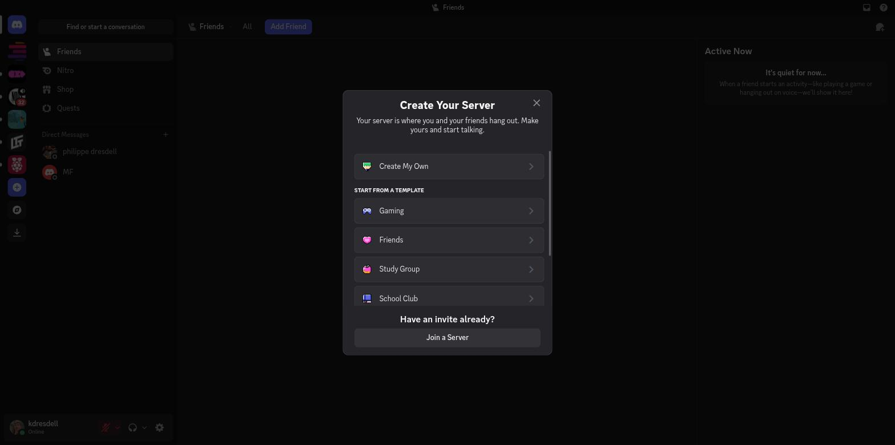

2. Click **Create My Own**.
3. Discord will ask who the server is for — pick whichever option fits best (e.g. **For a club or community**).

   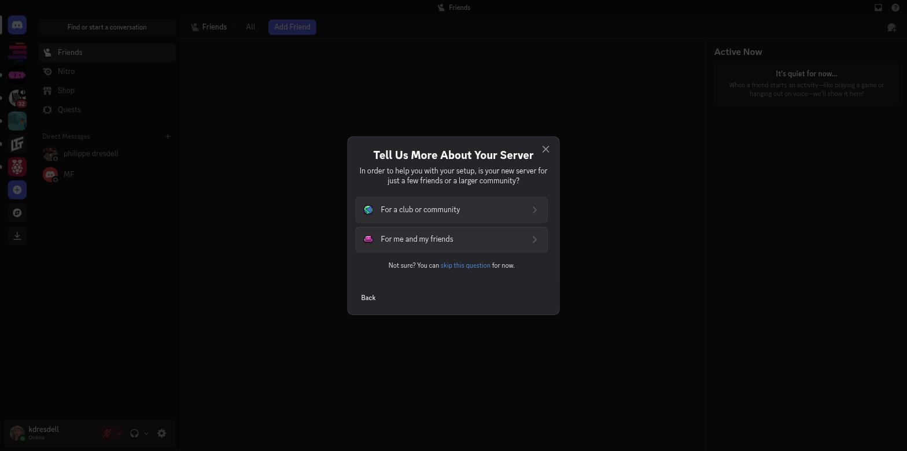

4. Give your server a name — ideally your activity's name (e.g. "Tuesday Hockey").

   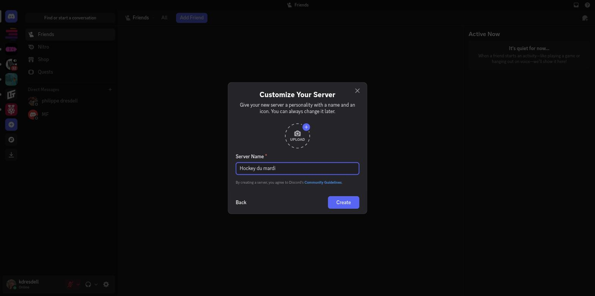

5. Click **Create**. Your server is ready!

   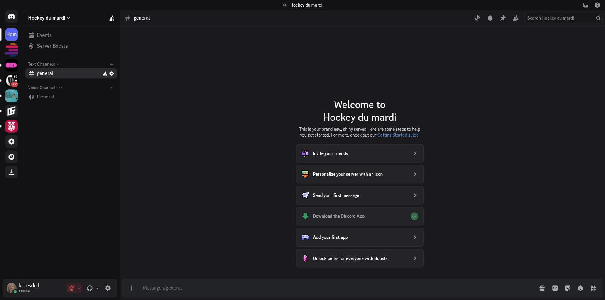

---

## Step 3 — Open the server settings

1. Click your **server's name** at the top left, then **Server Settings**.

   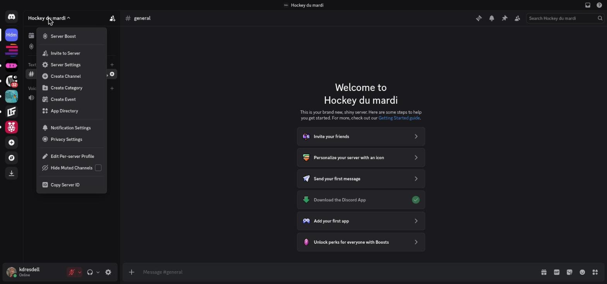

2. In the menu that opens on the left, find the **APPS** section, then click **Integrations**.

   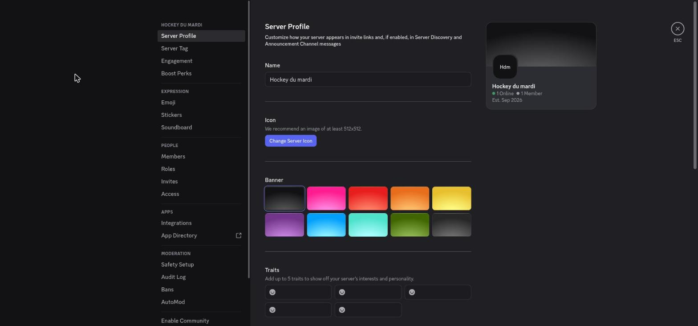

---

## Step 4 — Create the webhook

This is the key step: the webhook is the address Minipass will use to post your announcements into Discord.

1. On the **Integrations** page, click **Create Webhook**.

   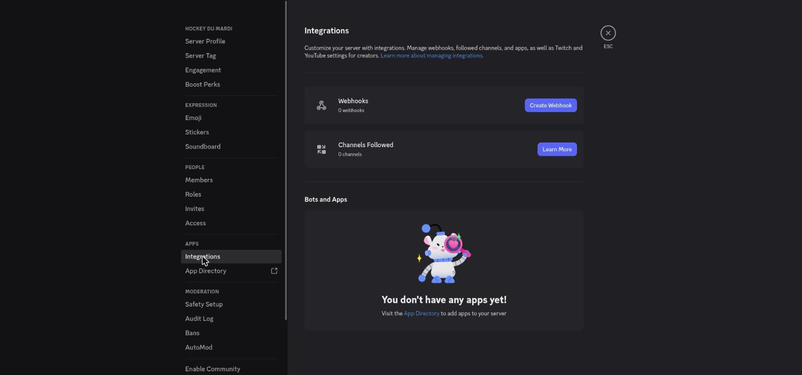

2. Discord creates a webhook with a default name (often "Spidey Bot") pointed at the **#general** channel.

   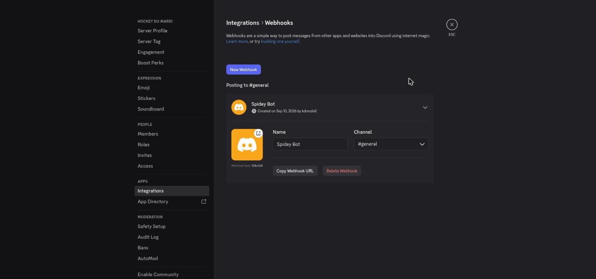

3. Rename it — for example, "Minipass" — so it's easy to recognize. A bar appears at the bottom; click **Save Changes**.

   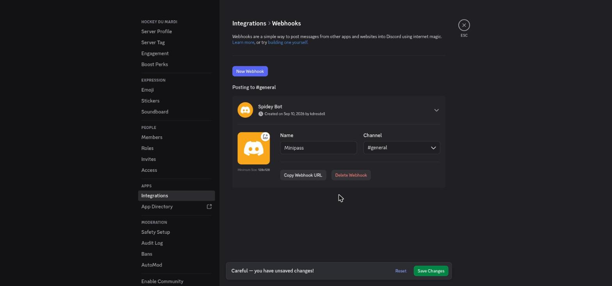

4. Click **Copy Webhook URL**. The address is copied to your clipboard — you don't need to see or retype it.

   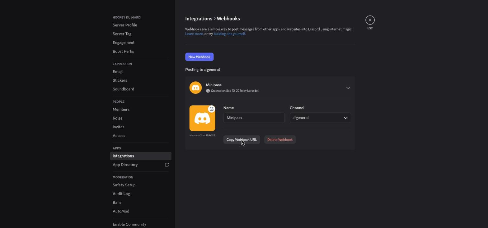

> ⚠️ **Important:** this address works like a password. Never share it publicly (email, website, social media) — anyone who has it can post messages into your Discord channel.

---

## Step 5 (optional) — Copy the invite link

If you'd also like your participants to be able to join your Discord server, copy the invite link:

1. Click the **Invite** icon at the top of the channel list.
2. At the bottom of the window, click **Copy** next to the invite link.

   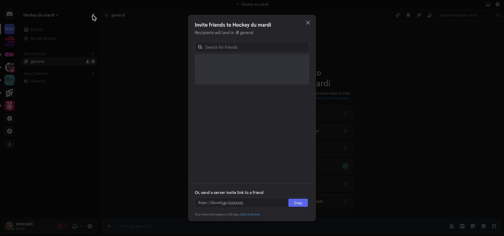

This link is different from the webhook — it's only for letting *people join* your server, not for posting announcements.

---

## Step 6 — Paste the address into Minipass

1. In Minipass, open your activity in edit mode.
2. Turn on the **This activity has a Discord server** toggle.
3. Paste the address you copied in Step 4 into the **Webhook URL** field.
4. (Optional) Paste the invite link you copied in Step 5 into the **Discord invite link** field.
5. Click **Test** to send a test message to your Discord server, then save.

   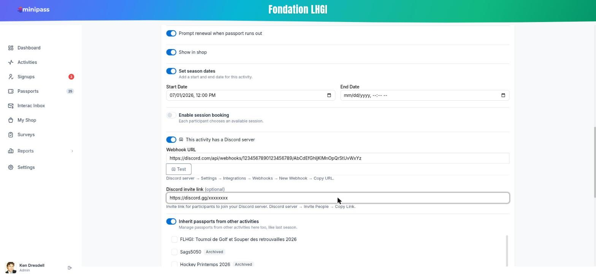

If the test message shows up in your Discord channel, everything is connected correctly.

---

## Good to remember

- The webhook is a private-use address — never publish it anywhere.
- You can rename or delete a webhook at any time from **Server Settings → Integrations**.
- Minipass announcements are always sent by email; Discord is an extra option, not a replacement.
- Always use the **Test** button in Minipass after pasting a new address, to confirm it works before sending a real announcement.
