# Six passeports — galerie de directions visuelles

*Courriel de passeport, activité payée. Six directions, même contenu, même code QR.*

**Version interactive (bascule clair/sombre, QR scannable) :** https://claude.ai/code/artifact/d182787c-4d88-4ca0-9de2-f36f5b0e8f3b

---

## Le principe

Même participante, même atelier, mêmes huit séances, même code QR. **Seul le design change.**
Pointer celui qui parle — ou piquer la structure de l'un et les couleurs de l'autre.
Rien ne se construit avant que la direction soit choisie.

Contenu d'exemple utilisé partout : Marie-Claude Bergeron · mc.bergeron@courriel.ca ·
« Poterie — tour et modelage » · 8 séances les mardis 19 h – 21 h · début 9 septembre 2026 ·
Centre communautaire Saint-Roch, 190 rue Chabot, Québec · réservations : émaillage 12 sept.,
four ouvert 27 sept. · référence PQ-7K4Q-9X2M.

Les spécimens sont rendus à **600 px**, la largeur d'un courriel, dans les **polices réellement
disponibles en courriel** — pile système, ou Georgia pour le sérif. Aucune police web : elles ne
chargent pas de façon fiable dans les boîtes de réception, donc les montrer serait un mensonge.

---

## 1. L'anatomie d'un passeport numérique

Apple et Google sont arrivés au même schéma, chacun de leur côté. Ce n'est pas une mode :
c'est ce qui reste lisible en une seconde, à l'entrée d'une salle, sur un téléphone à 20 %
de luminosité.

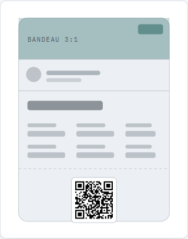

**01 — Le bandeau image, large et court.**
Apple l'appelle `strip image`, Google `hero image` et impose le **1032 × 336 px, ratio 3:1**.
Le titre de l'activité se pose dessus, jamais à côté.

**02 — L'info essentielle en haut à droite.**
La règle la plus forte d'Apple, et la moins évidente : c'est la seule zone visible quand le
pass est replié dans Wallet. La date y va, pas le logo.

**03 — Des champs courts, hiérarchisés, jamais du texte libre.**
`primary` tient environ **20 caractères** et se fait tronquer sans retour à la ligne — pas de
renvoi, pas de défilement. Puis `secondary`, puis jusqu'à **deux rangées de quatre champs
auxiliaires**.

**04 — Le code tout en bas, isolé.**
Séparé du reste par une rupture visuelle. Chez Google, des emplacements d'image sont même
prévus au-dessus et en dessous du code-barres — le code est une zone, pas un élément parmi
d'autres.

Sources :
[Apple — Designing passes](https://developers.apple.com/design/human-interface-guidelines/technologies/wallet/designing-passes) ·
[Google — Event tickets brand guidelines](https://developers.google.com/wallet/tickets/events/resources/brand-guidelines)

---

## 2. La contrainte qui élimine des designs

Celle-ci tranche des débats esthétiques avant qu'ils commencent.

- ✅ **Noir sur blanc pur, 200 px minimum, avec sa marge de silence.**
  Pas de QR coloré, pas de QR sur fond sombre, pas de logo au centre. Un scanner à l'entrée
  d'une salle ne pardonne pas.
- ✅ **La référence en texte sélectionnable, juste sous le code.**
  Outlook desktop bloque les images externes par défaut : sans le texte, le billet arrive vide.
  C'est le vrai filet de sécurité, pas le QR.
- ✅ **Un bouton vers la page passeport en ligne.**
  La page est la source de vérité, le courriel n'est qu'une commodité.
- ❌ **Le QR posé sur la photo ou sur la couleur de marque.**
  C'est la première chose que tout le monde essaie, et ça casse au scan.

---

## 3. Les six directions

### 01 · Carte Wallet
*L'anatomie Apple Wallet portée telle quelle en courriel.*

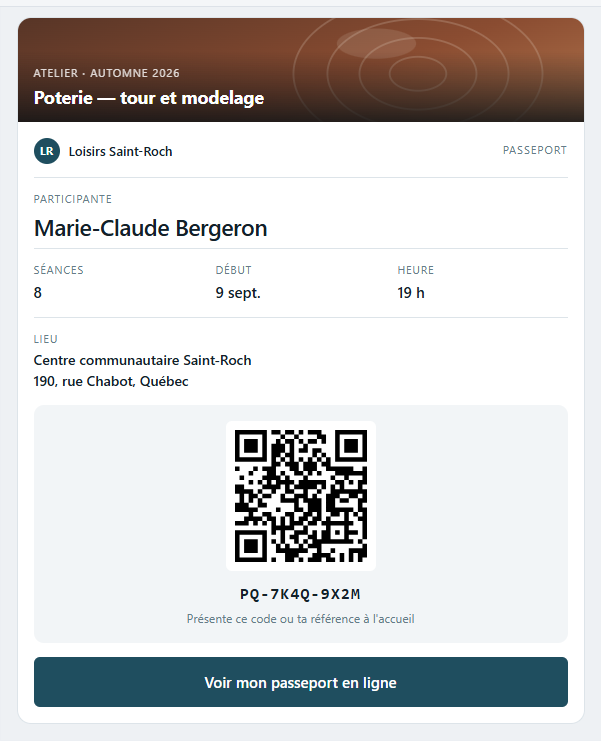

- **Le pari** — Familier. Ça ressemble à ce que les gens ont déjà dans leur téléphone, donc
  personne n'a besoin qu'on lui explique ce que c'est.
- **Ce que ça coûte** — Les coins arrondis et l'ombre disparaissent dans Outlook desktop : la
  carte y devient un rectangle net. Acceptable, mais il faut l'assumer.
- **Images bloquées** — Solide : seul le bandeau disparaît, toute la hiérarchie tient en texte.

En mode sombre

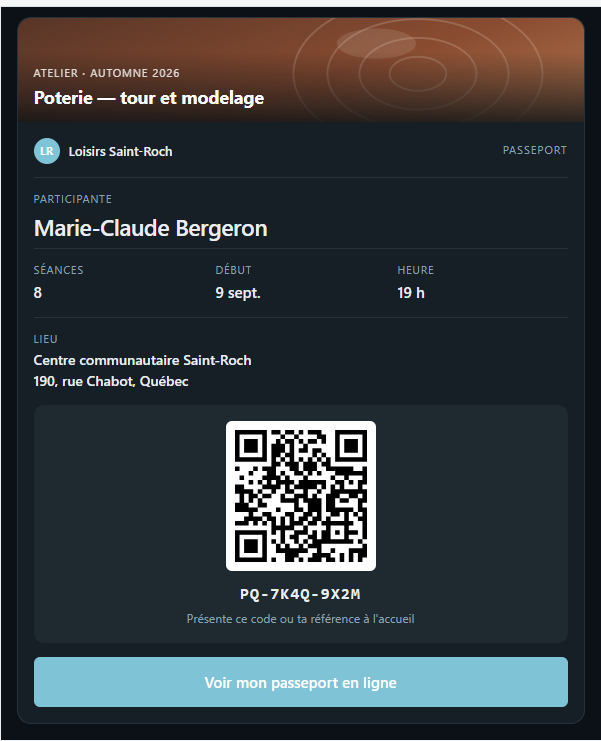

---

### 02 · Carte d'embarquement
*Aviation et train : talon détachable, ligne de déchirure, code à droite.*

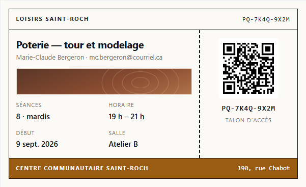

- **Le pari** — Ça se lit « billet » instantanément, sans un mot d'explication. La ligne
  pointillée fait tout le travail.
- **Ce que ça coûte** — La mise en page en deux colonnes est la plus fragile de la série en
  courriel. Sous 460 px, le talon passe dessous — il faut l'accepter, pas le combattre.
- **Images bloquées** — Excellente : la photo n'est qu'un accent, la structure est faite de
  bordures.

En mode sombre

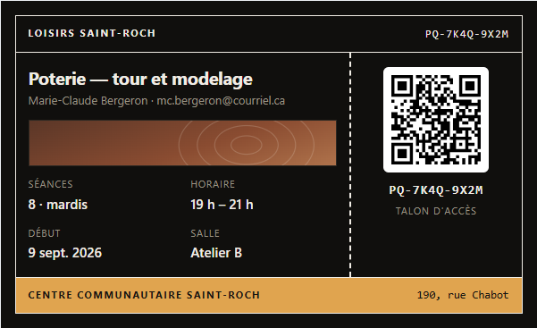

---

### 03 · Éditorial minimal
*Luma, Linear, Notion : grande typo, beaucoup de blanc, zéro chrome.*

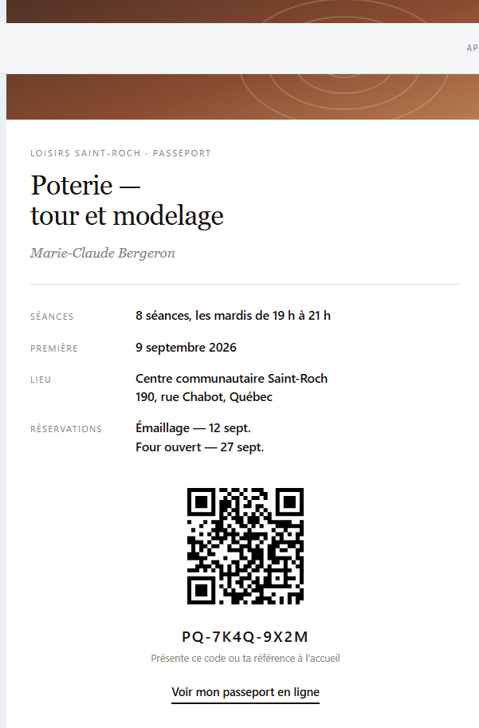

- **Le pari** — Le plus moderne des six, et le seul sans une seule couleur d'accent : la typo
  porte tout. Georgia est disponible partout en courriel, donc ce rendu-là est honnête.
- **Ce que ça coûte** — Le plus risqué si le contenu devient dense. Avec quinze réservations,
  cette page s'effondre — elle vit de son blanc.
- **Images bloquées** — Parfaite, à un détail près : sans le bandeau, le courriel démarre sur
  du texte nu. Un préen-tête soigné devient obligatoire.

En mode sombre

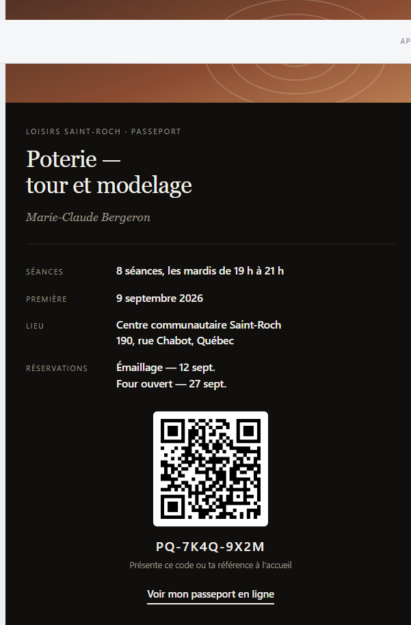

---

### 04 · Reçu épuré
*Stripe : gris, filets fins, chiffres alignés, zéro décoration.*

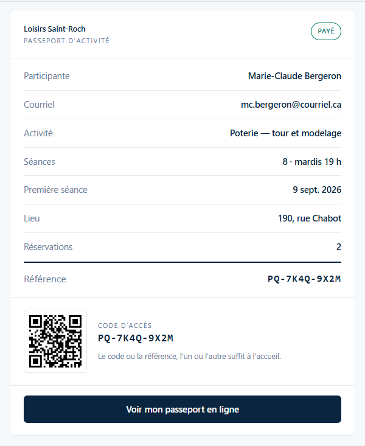

- **Le pari** — Le plus *lean* de la série. Sérieux, sobre, indiscutable — c'est le langage
  des reçus, et ça inspire confiance sur l'argent.
- **Ce que ça coûte** — Aucune émotion, et la photo de l'activité n'a nulle part où aller.
  Pour un atelier de loisir, c'est peut-être trop froid.
- **Images bloquées** — La meilleure des six : il n'y a presque rien à bloquer.

En mode sombre

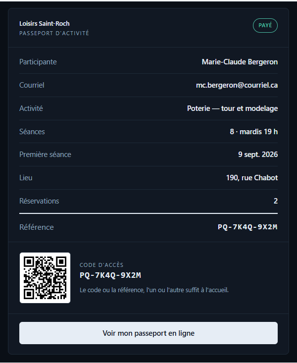

---

### 05 · Carte de membre
*Carte d'identité : photo à gauche, champs à droite, bordure marquée.*

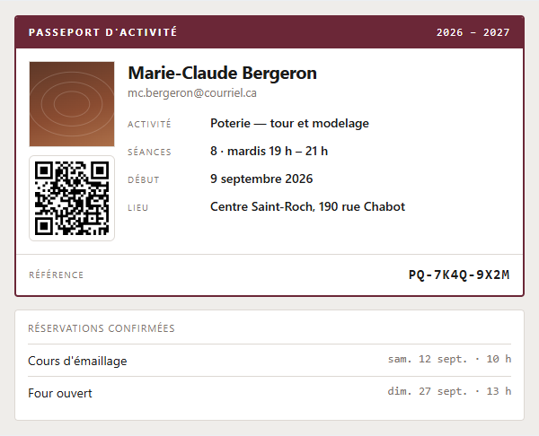

- **Le pari** — Le seul qui mérite vraiment le mot « passeport ». Et le seul dont la structure
  encaisse sans broncher une liste de réservations qui s'allonge.
- **Ce que ça coûte** — Deux colonnes, donc même fragilité que la 02 en dessous de 430 px.
  Et la bordure de 2 px doit être une vraie bordure de table pour survivre à Outlook.
- **Images bloquées** — Bonne, mais la colonne de gauche se vide à moitié : il faut lui donner
  une largeur fixe pour que la mise en page ne saute pas.

En mode sombre

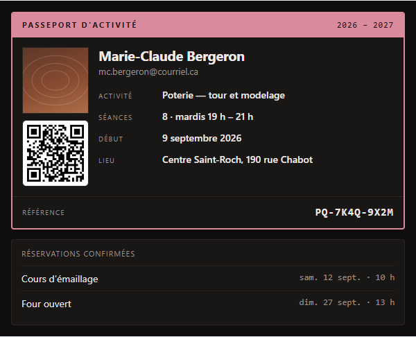

---

### 06 · Billet sombre
*Dice, Ticketmaster : photo en héros, fond noir, code sur pastille blanche.*

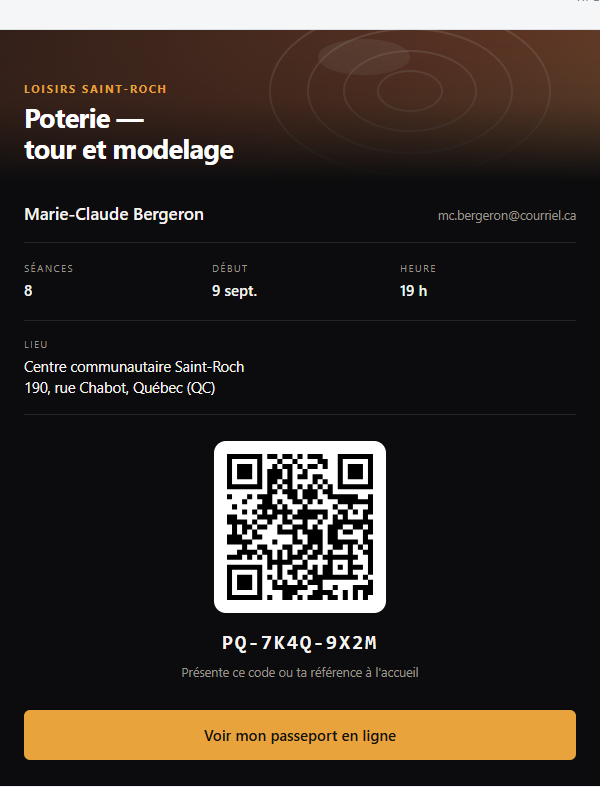

- **Le pari** — Le plus spectaculaire, et celui qui donne le plus envie d'y aller. La pastille
  blanche autour du QR n'est pas un choix esthétique : c'est ce qui le rend scannable.
- **Ce que ça coûte** — Le plus casse-gueule en courriel. Un fond sombre codé en dur se fait
  ré-inverser par Outlook mobile, et le résultat est imprévisible. Il n'a pas de variante
  claire : il est sombre par identité.
- **Images bloquées** — La pire des six : sans le héros, il ne reste qu'un grand vide noir en
  haut du message.

---

## 3bis. Sur mobile — mesuré, pas supposé

**80 % des passeports s'ouvrent sur un téléphone.** Les six spécimens ont donc été rendus à
**325 px** (la largeur utile réelle sur un iPhone) et mesurés, pas juste regardés.

### Ce que la première version cassait

| Direction | QR rendu | Cible tactile | Verdict |
|---|---|---|---|
| 01 Wallet | 132 px | 51 px | limite |
| 02 Embarquement | **100 px** | — | trop petit |
| 03 Éditorial | 146 px | **26 px** | cible trop petite |
| 04 Reçu | **86 px** | 46 px | trop petit |
| 05 Membre | **78 px** | — | inutilisable |
| 06 Sombre | 146 px | 51 px | acceptable |

Le QR suivait la largeur de la carte. À 78 px, un code de 29 modules descend à **2,7 px par
module** — sous le seuil où une caméra de téléphone accroche de façon fiable. Ça contredisait
la règle « QR ≥ 200 px » posée plus haut dans ce même document.

### La correction

**Un code QR ne rétrécit jamais.** Il sort du flux et garde une taille fixe, quelle que soit la
largeur. Sous 520 px : QR à 180 px déclarés (158–160 px rendus, soit ~5,5 px par module), cibles
tactiles à 48 px minimum, et les deux mises en page à deux colonnes (02 et 05) passent en une
seule colonne.

| Direction | QR rendu | Cible tactile | Hauteur mobile |
|---|---|---|---|
| 01 Wallet | 160 px ✅ | 51 px ✅ | 787 px |
| 02 Embarquement | 160 px ✅ | — | 670 px |
| 03 Éditorial | 160 px ✅ | 54 px ✅ | **1115 px** |
| 04 Reçu | 158 px ✅ | 48 px ✅ | 911 px |
| 05 Membre | 158 px ✅ | — | 809 px |
| 06 Sombre | 160 px ✅ | 51 px ✅ | 819 px |

Aucun débordement horizontal sur les six.

### Les six, à 325 px

| | |
|---|---|
| **01 · Carte Wallet** — traverse le mieux. La grille de trois champs tient encore, rien ne se réorganise. | 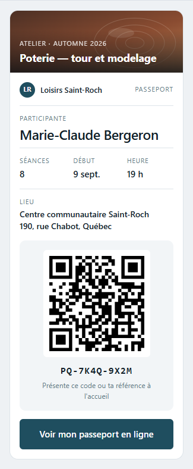 |
| **02 · Carte d'embarquement** — *meilleure* sur mobile que sur ordinateur : le talon passe dessous et la ligne pointillée devient horizontale, exactement comme un vrai billet à détacher. | 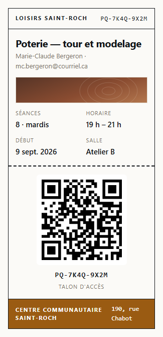 |
| **03 · Éditorial minimal** — le plus faible des six ici. **1115 px de haut**, presque le double de la 02 : le blanc qui fait sa beauté sur grand écran devient du défilement sur téléphone. | 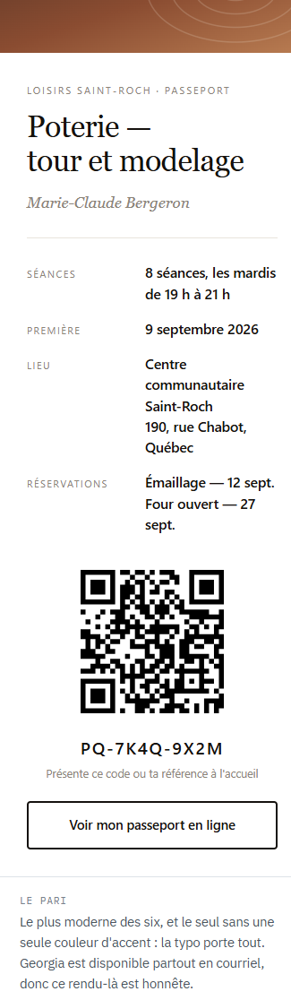 |
| **04 · Reçu épuré** — tient bien, mais les paires clé-valeur se resserrent : les valeurs longues passent à la ligne et l'alignement à droite perd de sa force. | 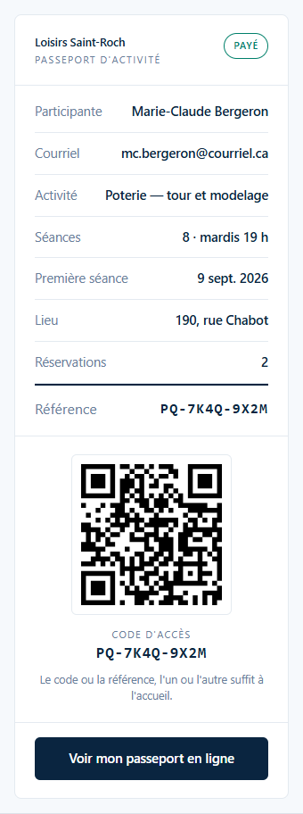 |
| **05 · Carte de membre** — photo pleine largeur, QR centré dessous, champs empilés. Passe de la pire à l'une des meilleures une fois corrigée. | 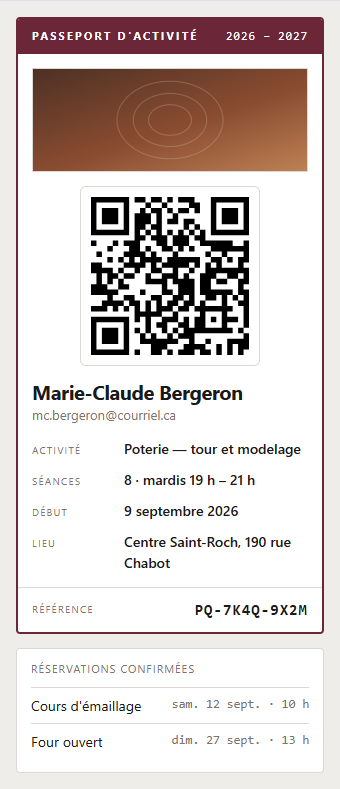 |
| **06 · Billet sombre** — le héros pleine largeur fonctionne encore mieux sur téléphone. Reste le risque de ré-inversion par Outlook mobile. | 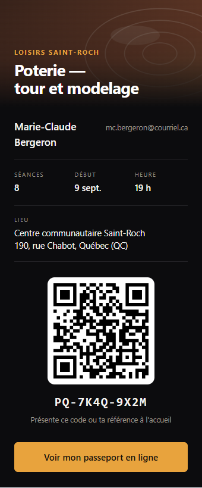 |

### Le classement mobile

1. **02 Carte d'embarquement** — la plus compacte (670 px) et la seule qui gagne à rétrécir.
2. **01 Carte Wallet** — solide partout, aucune surprise.
3. **05 Carte de membre** et **06 Billet sombre** — bons, avec leurs réserves respectives.
4. **04 Reçu épuré** — correct, un peu serré.
5. **03 Éditorial minimal** — le plus beau sur grand écran, le plus coûteux sur téléphone.

**La règle à retenir pour le design system :** ce qui casse sur mobile, ce n'est jamais la
couleur ni la typo — c'est ce qui a été dimensionné en proportion au lieu d'être dimensionné en
absolu. Le QR, les cibles tactiles et le corps de texte se déclarent en valeurs fixes ; tout le
reste peut suivre la largeur.

---

## 4. Les séances et les réservations

Eventbrite et Ticketmaster vendent un billet pour *une* date. Ici, il y a huit séances et des
réservations qui s'ajoutent en cours de session. Trois façons de traiter cette liste — elle se
greffe sur n'importe laquelle des six directions.

### A · Tableau compact

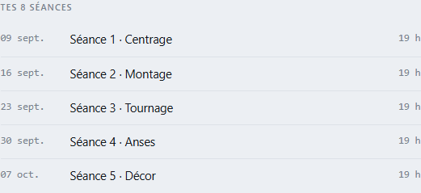

- **Quand** — Quand les dates comptent autant que les titres. Les colonnes alignées en chiffres
  tabulaires se scannent verticalement.
- **Limite** — Au-delà de dix lignes, le courriel devient un tableur.

### B · Liste à statut

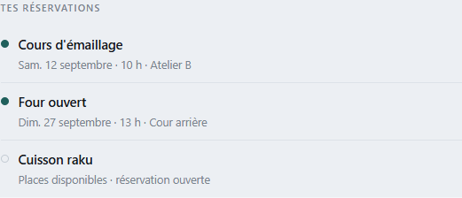

- **Quand** — Quand il y a une action à provoquer. La pastille vide invite à réserver sans une
  phrase de plus.
- **Limite** — La couleur seule ne suffit pas à porter le statut : il faut aussi le mot.

### C · Prochaine séance en gros

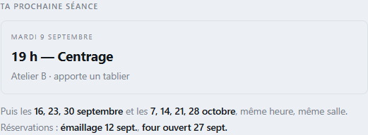

- **Quand** — Le meilleur des trois pour un courriel. Personne n'ouvre un passeport pour lire
  huit dates : on l'ouvre pour savoir si c'est ce soir.
- **Limite** — Demande que le courriel soit régénéré à chaque séance, ou que la page en ligne
  prenne le relais.

---

## 5. Ce qui se passe une fois la direction pointée

Un mélange est une réponse parfaitement valide — « la structure de la 02, les couleurs de la 04,
le bloc séances C ». C'est même le résultat le plus probable.

1. La direction retenue devient un jeu de **jetons** (couleurs, échelle d'espacement, typo) et
   un **gabarit Jinja2 partagé**.
2. Les quatre courriels du parcours s'y branchent : inscription, rappel de paiement, reçu,
   passeport. Même squelette, contenu différent.
3. **Premailer** inline le CSS à l'envoi, **Mailpit** vérifie le rendu et la compatibilité
   client avant qu'un seul message parte.
4. Le passeport gagne son bloc **JSON-LD `EventReservation`** : Gmail affiche alors une carte
   avec « Ajouter au calendrier » et « Itinéraire », et pousse la séance dans l'agenda du
   participant.

---

## Annexe — la conformité, en bref

Ce que « RFC compliant » veut dire concrètement pour ces courriels :

- **`multipart/alternative`** avec une vraie partie `text/plain` non vide (RFC 2045-2047).
  Un transactionnel HTML seul se fait pénaliser.
- **`Message-ID` unique** qualifié par le domaine (RFC 5322). Absent ou dupliqué = signal de spam.
- **`Auto-Submitted: auto-generated`** (RFC 3834) et **`X-Auto-Response-Suppress: All`** pour
  éviter que les réponses d'absence Outlook reviennent sur la boîte d'envoi.
- **`In-Reply-To` / `References`** sur le `Message-ID` du premier courriel, pour que les quatre
  messages d'une même inscription se regroupent en une seule conversation.
- **Pas de `List-Unsubscribe`** sur un reçu ou un billet : ça les fait classer comme du marketing.
- **SPF, DKIM et DMARC** doivent tous passer **et être alignés** avec le domaine du `From`.
  Vérification : [mail-tester.com](https://www.mail-tester.com/).

Outils : [Mailpit](https://mailpit.axllent.org/) (SMTP local + score de compatibilité client) ·
[Premailer](https://github.com/peterbe/premailer) (inlining CSS en Python) ·
[caniemail.com](https://www.caniemail.com/) (support CSS par client) ·
[postmark-templates](https://github.com/ActiveCampaign/postmark-templates) (base HTML, MIT).

---

*Les images de ce document sont dans `six-passeports-img/`, à côté du fichier. Garde les deux
ensemble si tu le déplaces.*
